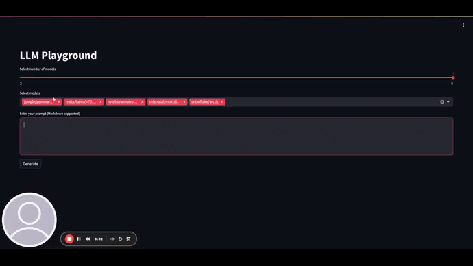

# LLM Playground

This project is a dynamic, parallel multi-model application built using Streamlit. The application allows users to select various language models, input a prompt, and receive generated outputs from each model in parallel.



## Project Structure

## 📜Folder and File description
    .
    ├── app/
    |   ├── __init__.py
    |   ├── main.py
    |   ├── models.py
    |   ├── ui.py
    |   ├── utils.py
    ├── run.py
    ├── rrequirements.txt
    ├── run.sh

## Files Description

### `app/__init__.py`

An empty file to mark the `app` directory as a Python package.

### `app/main.py`

Contains the main logic of the application:
- **Imports**: Necessary modules from Streamlit, models, UI, and utils.
- **CSS Styles**: Inline CSS to style the application.
- **`run_app` Function**: Configures the page layout and title, applies CSS styles, creates the UI, and handles the "Generate" button press.
- **`generate_outputs` Function**: Sets up columns for displaying model outputs, uses threading to run each model's output generation in parallel, and processes and displays the output from each model in real-time.

### `app/models.py`

Handles the interaction with the language models:
- **Model List**: A list of available models.
- **`model_output` Function**: Interacts with the OpenAI API to get responses from the models and simulates streaming output by chunking the response and sending it back through a queue.

### `app/ui.py`

Responsible for creating the UI elements:
- **`create_ui` Function**: Creates the user interface for selecting models and entering the prompt.

### `app/utils.py`

Contains utility functions for processing text:
- **`process_markdown` Function**: Converts Markdown text to HTML, handling code blocks and inline code.

### `run.py`

The entry point of the application. It calls the `run_app` function from `main.py`.

## Installation

1. Clone the repository:
   ```bash
   git clone <repository_url>
   cd project_root
